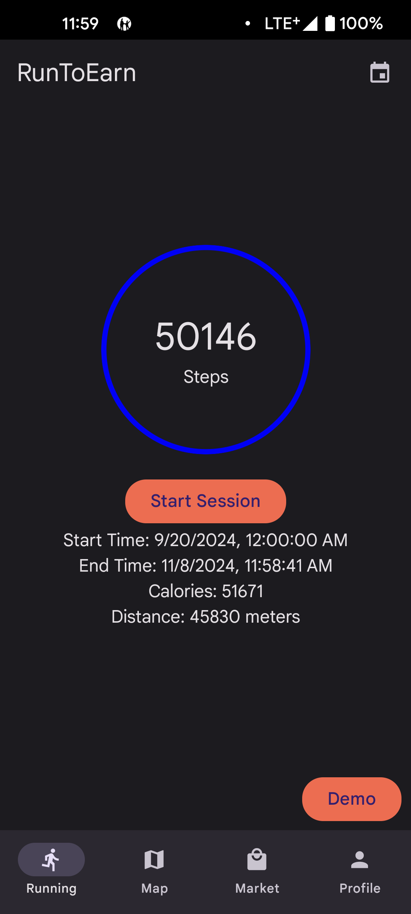
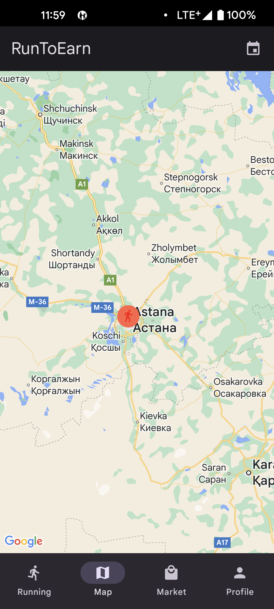
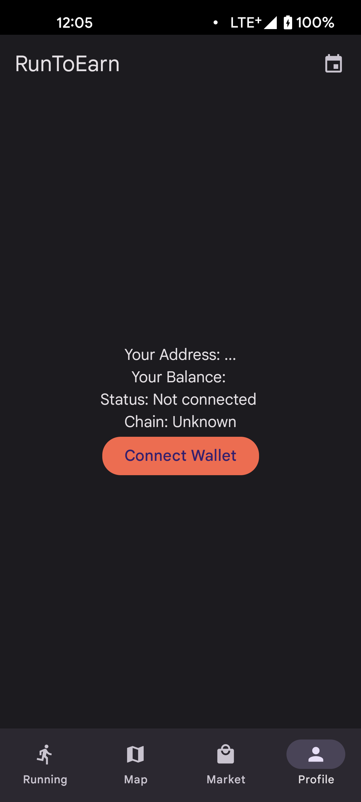
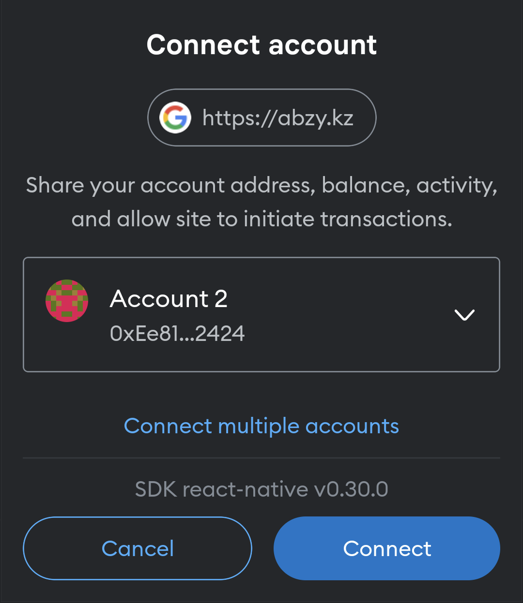
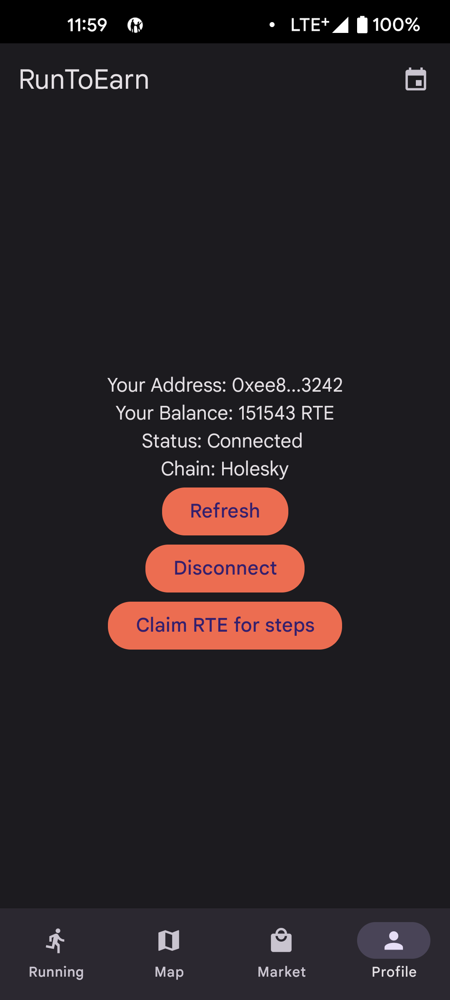
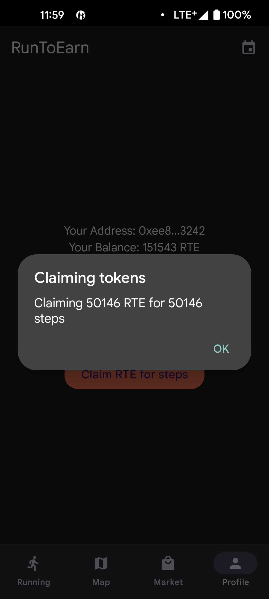

# RunToEarn Mobile

## Usage

1. Download `*apk` file from the latest release
2. Install the app on your Android device
3. Open the app
4. Start a new run
5. Finish the run after you're done
6. Open the Profile tab to see your earnings
7. Claim your earnings
8. Withdraw your earnings using Marketplace tab
9. Enjoy your earnings!

## Screenshots

### Running

### Map

### Market

### Profile (before connection)

### Connection with Metamask

### Profile (when connected)

## Claiming Earnings

## Examples

1. Starting app for a morning run
2. Starting app during commute to work
3. Starting app for a gym workout
